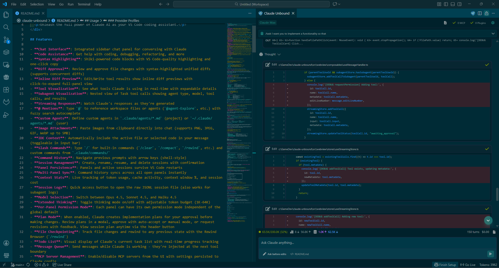
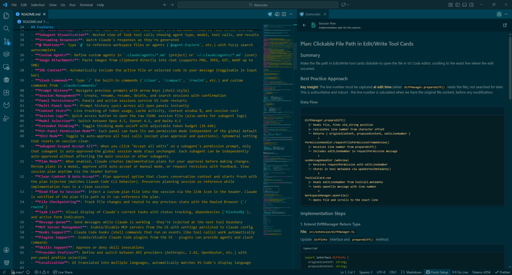
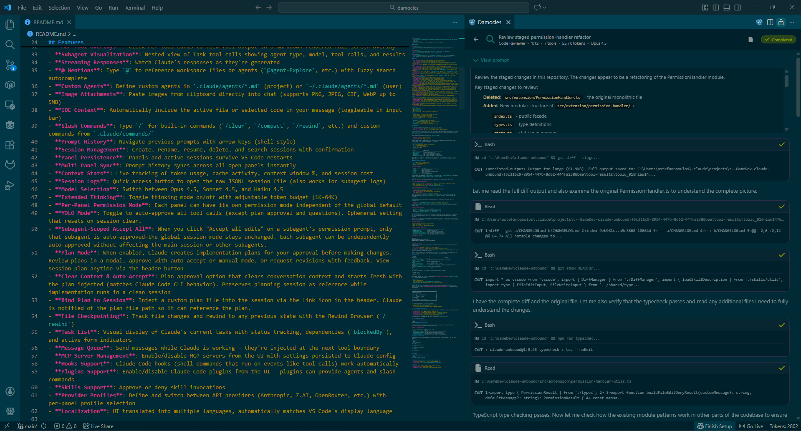

<div align="center">
  
  <h1>Claude Unbound</h1>
  <p>Unleash the full power of Claude AI as your VS Code coding assistant.</p>
</div>

## Screenshots

<div align="center">
  
  <p><em>Chat interface with Edit tool cards showing syntax-highlighted inline diffs</em></p>
</div>

<div align="center">
  
  <p><em>Plan View displaying implementation plans for review</em></p>
</div>

<div align="center">
  
  <p><em>Subagent View showing nested agent actions with real-time tool visualization</em></p>
</div>

## Features

- **Chat Interface**: Integrated sidebar chat panel for conversing with Claude
- **Code Assistance**: Get help with coding, debugging, refactoring, and more
- **Syntax Highlighting**: Shiki-powered code blocks with VS Code-quality highlighting and one-click copy
- **Diff Approval**: Review and approve file changes with syntax-highlighted unified diffs (supports concurrent diffs)
- **Inline Diff Preview**: Edit/Write tool results show inline diff previews with click-to-expand full-panel view
- **Tool Visualization**: See what tools Claude is using in real-time with expandable details
- **MCP Tool Overlays**: Click MCP tool cards to view full output in a markdown-rendered full-screen overlay
- **Subagent Visualization**: Nested view of Task tool calls showing agent type, model, tool calls, and results
- **Streaming Responses**: Watch Claude's responses as they're generated
- **@ Mentions**: Type `@` to reference workspace files or agents (`@agent-Explore`, etc.) with fuzzy search autocomplete
- **Custom Agents**: Define custom agents in `.claude/agents/*.md` (project) or `~/.claude/agents/*.md` (user)
- **Image Attachments**: Paste images from clipboard directly into chat (supports PNG, JPEG, GIF, WebP up to 5MB)
- **IDE Context**: Automatically include the active file or selected code in your message (toggleable in input bar)
- **Slash Commands**: Type `/` for built-in commands (`/clear`, `/compact`, `/rewind`, etc.) and custom commands from `.claude/commands/`
- **Command History**: Navigate previous prompts with arrow keys (shell-style)
- **Session Management**: Create, rename, resume, and delete sessions with confirmation
- **Panel Persistence**: Panels and active sessions survive VS Code restarts
- **Multi-Panel Sync**: Command history syncs across all open panels instantly
- **Context Stats**: Live tracking of token usage, cache activity, context window %, and session cost
- **Session Logs**: Quick access button to open the raw JSONL session file (also works for subagent logs)
- **Model Selection**: Switch between Opus 4.5, Sonnet 4.5, and Haiku 4.5
- **Extended Thinking**: Toggle thinking mode on/off with adjustable token budget (1K-64K)
- **Per-Panel Permission Mode**: Each panel can have its own permission mode independent of the global default
- **YOLO Mode**: Toggle to auto-approve all tool calls (except plan approval and questions). Ephemeral setting that resets on session clear.
- **Subagent-Scoped Accept All**: When you click "Accept all edits" on a subagent's permission prompt, only that subagent is auto-approved—the global session mode stays unchanged. Each subagent can be independently auto-approved without affecting the main session or other subagents.
- **Plan Mode**: When enabled, Claude creates implementation plans for your approval before making changes. Review plans in a modal, approve with auto-accept or manual mode, or request revisions with feedback. View session plan anytime via the header button
- **Clear Context & Auto-Accept**: Plan approval option that clears conversation context and starts fresh with the plan injected (matches Claude Code CLI behavior). Preserves planning session as reference while implementation runs in a clean session
- **Bind Plan to Session**: Inject a custom plan file into the session via the link icon in the header. Claude is notified of the plan file path so it can reference the plan.
- **File Checkpointing**: Track file changes and rewind to any previous state with the Rewind Browser (`/rewind`)
- **Todo List**: Visual display of Claude's current task list with real-time progress tracking
- **Message Queue**: Send messages while Claude is working - they're injected at the next tool boundary
- **MCP Server Management**: Enable/disable MCP servers from the UI with settings persisted to Claude config
- **Hooks Support**: Claude Code hooks (shell commands that run on events like tool calls) work automatically
- **Plugins Support**: Enable/disable Claude Code plugins from the UI - plugins can provide agents and slash commands
- **Skills Support**: Approve or deny skill invocations
- **Provider Profiles**: Define and switch between API providers (Anthropic, Z.AI, OpenRouter, etc.) with per-panel profile selection
- **Localization**: UI translated into multiple languages, automatically matches VS Code's display language

## Installation

1. Clone the repository
2. Run `npm install`
3. Run `npm run build`
4. Press F5 in VS Code to launch the Extension Development Host

## Usage

- Click the Claude Unbound icon in the editor title bar (top right)
- Type your question or request in the chat input
- Press Enter to send (Shift+Enter for new line)
- Review any file changes in the diff view before approving

### Keyboard Shortcuts

- `Ctrl+Shift+U` / `Cmd+Shift+U`: Focus the chat panel
- `↑` / `↓`: Navigate through command history (like terminal shell)
- `Shift+Tab`: Cycle through permission modes
- `Escape`: Cancel current request (when processing)
- `Escape Escape`: Open rewind popup to restore previous state

### IDE Context

The input bar shows a context indicator that tracks your active editor:

- **Eye icon + line count**: When you have code selected, shows "N lines"
- **Code icon + filename**: When a file is open without selection, shows the filename

Click the indicator to toggle whether the context is included in your next message. When enabled, the selected code (or entire file) is automatically injected into your prompt—no need to manually @mention or paste code.

### Image Attachments

Paste images directly into the chat input with `Ctrl+V` / `Cmd+V`:

- **Supported formats**: PNG, JPEG, GIF, WebP
- **Size limit**: 5MB per image
- **Max attachments**: 10 images per message

Attached images appear as thumbnails below the input. Hover over a thumbnail to reveal the remove button. Click any image in the conversation to open it in a lightbox.

#### @ Mention Autocomplete

- `@`: Trigger autocomplete popup for files and agents
- `↑` / `↓`: Navigate suggestions
- `Tab` / `Enter`: Insert selected item
- `Escape`: Close popup

**Mention types:**

| Syntax                   | Description                                  |
| ------------------------ | -------------------------------------------- |
| `@path/to/file.ts`       | Reference a workspace file                   |
| `@agent-Explore`         | Use the fast codebase exploration agent      |
| `@agent-Plan`            | Use the architecture planning agent          |
| `@agent-<name>`          | Use a custom agent from `.claude/agents/`    |
| `@agent-<plugin>:<name>` | Use an agent provided by an installed plugin |

Custom agents are loaded from `.claude/agents/*.md` (project) and `~/.claude/agents/*.md` (user). Project agents override user agents with the same name. Plugin agents are loaded from enabled plugins' `agents/` directories.

#### Slash Command Autocomplete

- `/`: Trigger command autocomplete popup
- `↑` / `↓`: Navigate suggestions
- `Tab` / `Enter`: Insert selected command
- `Escape`: Close popup

**Built-in commands:**

| Command            | Description                              |
| ------------------ | ---------------------------------------- |
| `/clear`           | Clear conversation history               |
| `/compact`         | Compact conversation                     |
| `/rewind`          | Rewind conversation/code to a checkpoint |
| `/review`          | Request code review                      |
| `/security-review` | Security review of changes               |
| `/init`            | Initialize CLAUDE.md                     |

Custom commands are loaded from `.claude/commands/*.md` (project) and `~/.claude/commands/*.md` (user). Plugin commands use the format `/<plugin>:<command>` (e.g., `/myplugin:build`).

### Skills

Skills are specialized tools that extend Claude's capabilities. You can invoke skills in two ways:

**Via slash command (recommended):**

- Type `/skill-name` to invoke a skill directly - it appears in the autocomplete popup alongside regular commands
- Skills invoked this way are **auto-approved** (no approval prompt)
- Pass arguments after the skill name: `/skill-name additional context here`

**Via Claude's autonomous invocation:**

When Claude decides to use a skill on its own, you'll see an approval prompt:

- **Yes**: Approve this invocation (manual mode)
- **Yes, don't ask again**: Auto-approve this skill for the session
- **No**: Deny the skill
- **Tell Claude what to do instead**: Provide custom feedback

Skills are loaded from `.claude/skills/<name>/SKILL.md` (project) and `~/.claude/skills/<name>/SKILL.md` (user). Plugin skills use the format `/plugin:skill-name`. The skill description is parsed from the YAML frontmatter.

### Plugins

Plugins extend Claude's capabilities with additional agents and slash commands. Installed plugins are discovered from:

- **Registry**: `~/.claude/plugins/installed_plugins.json` (managed by Claude Code CLI)
- **Manual**: `<project>/.claude/plugins/*/` directories with `.claude-plugin/plugin.json`

Enable or disable plugins from the plugin status panel in the UI. Plugin settings are persisted to Claude's settings files.

**Plugin-provided features:**

| Feature        | Syntax                   | Example               |
| -------------- | ------------------------ | --------------------- |
| Agents         | `@agent-<plugin>:<name>` | `@agent-pdf:analyzer` |
| Slash commands | `/<plugin>:<command>`    | `/pdf:extract`        |

### Provider Profiles

Provider profiles allow you to define and switch between different API providers (Anthropic, Z.AI, OpenRouter, etc.) directly from the settings panel. Each profile stores environment variables that configure the SDK's connection.

**Security:** API credentials are encrypted using VS Code's SecretStorage API (backed by the OS keychain) and never stored in settings.json. Profile names are visible in settings, but all environment variables containing API keys are stored securely.

**Creating a profile:**

1. Open the settings panel (gear icon in chat header)
2. Scroll to "Provider Profiles" section
3. Click "Add Profile"
4. Enter a profile name and add environment variables

**Common environment variables:**

| Variable                         | Purpose                                   |
| -------------------------------- | ----------------------------------------- |
| `ANTHROPIC_BASE_URL`             | Custom API endpoint URL                   |
| `ANTHROPIC_AUTH_TOKEN`           | API key or auth token for the provider    |
| `ANTHROPIC_DEFAULT_OPUS_MODEL`   | Model name to use when Opus is selected   |
| `ANTHROPIC_DEFAULT_SONNET_MODEL` | Model name to use when Sonnet is selected |
| `ANTHROPIC_DEFAULT_HAIKU_MODEL`  | Model name to use when Haiku is selected  |

**Example: Z.AI Profile**

```
Name: zai
ANTHROPIC_BASE_URL: https://api.zai.com/v1
ANTHROPIC_AUTH_TOKEN: your-zai-api-key
ANTHROPIC_DEFAULT_SONNET_MODEL: claude-sonnet-4-20250514
```

**Per-panel profiles:**

Each open panel can have its own provider profile independent of other panels. The settings panel shows two profile selectors:

- **This panel**: The provider profile for the current panel only
- **Default for new panels**: The global default that new panels inherit when opened

This allows you to have multiple panels open simultaneously, each connected to a different provider (e.g., one panel using OpenRouter while another uses Z.AI).

When you activate a profile, the session automatically restarts with the new provider configuration. Set to "Default" to use the Anthropic API with your `ANTHROPIC_API_KEY` environment variable.

## Configuration

| Setting                                | Description                                                                  | Default   |
| -------------------------------------- | ---------------------------------------------------------------------------- | --------- |
| `claude-unbound.permissionMode`        | How to handle tool permissions (`default`, `acceptEdits`, `plan`)            | `default` |
| `claude-unbound.maxTurns`              | Maximum conversation turns per session                                       | `100`     |
| `claude-unbound.maxIndexedFiles`       | Maximum files to index for @ mention autocomplete                            | `5000`    |
| `claude-unbound.providerProfiles`      | Array of provider profile names (credentials stored securely in OS keychain) | `[]`      |
| `claude-unbound.activeProviderProfile` | Currently active provider profile name                                       | `null`    |

## Localization

The extension automatically uses VS Code's display language. Currently supported:

| Language | Code |
| -------- | ---- |
| English  | `en` |
| Greek    | `el` |

To change the language, set VS Code's display language via **Configure Display Language** command (`Ctrl+Shift+P` → "Configure Display Language").

## Requirements

- VS Code 1.95.0 or higher
- Claude Code installed (`npm install -g @anthropic-ai/claude-code`)
- `ANTHROPIC_API_KEY` environment variable set (see Authentication below)

## Authentication

Claude Unbound uses the [Claude Agent SDK](https://platform.claude.com/docs/en/agent-sdk/typescript), which uses Claude Code as its runtime. **The extension does not handle authentication directly** — it delegates entirely to Claude Code.

### How It Works

```
┌─────────────────────────────────────────────────────────┐
│  Claude Unbound Extension                               │
│         │                                               │
│         ▼                                               │
│  @anthropic-ai/claude-agent-sdk                         │
│         │                                               │
│         ▼ (uses as runtime)                             │
│  Claude Code                                            │
│         │                                               │
│         ▼ (handles authentication)                      │
│  Anthropic API                                          │
└─────────────────────────────────────────────────────────┘
```

The SDK uses Claude Code as its runtime. This means:

- All Claude Code authentication methods work automatically
- Sessions persist in `~/.claude/projects/`
- Tool execution, sandboxing, and permissions are handled by Claude Code

### Why Claude Code CLI Is Required

The Claude Agent SDK uses Claude Code as its runtime — it's not a standalone API client. Claude Code provides:

- **Built-in tools** — Bash, Read, Write, Edit, Grep, Glob, etc.
- **Authentication** — OAuth session management, API keys, cloud provider credentials
- **Session persistence** — Conversation history stored in `~/.claude/projects/`
- **Sandboxing** — OS-level process isolation for safe command execution
- **Permissions** — Tool approval workflows and permission modes

Your extension calls the SDK API; the SDK handles everything else through Claude Code.

### Setting Up Authentication

**Option 1: API Key (Recommended)**

```bash
export ANTHROPIC_API_KEY=your-api-key
```

Get your API key from the [Anthropic Console](https://console.anthropic.com/). This is the officially recommended authentication method for SDK-based applications.

**Option 2: Cloud Providers**

For enterprise environments using cloud-hosted Claude:

| Variable                    | Purpose                                            |
| --------------------------- | -------------------------------------------------- |
| `CLAUDE_CODE_USE_BEDROCK=1` | Use AWS Bedrock (requires AWS credentials)         |
| `CLAUDE_CODE_USE_VERTEX=1`  | Use Google Vertex AI (requires GCP credentials)    |
| `CLAUDE_CODE_USE_FOUNDRY=1` | Use Microsoft Foundry (requires Azure credentials) |

### Verifying Authentication

Once authenticated, the extension displays your account info (email, subscription type) in the chat panel header.

## Development

```bash
# Install dependencies
npm install

# Build extension and webview
npm run build

# Watch mode for development
npm run dev

# Type check
npm run typecheck
```

## Packaging

To create a distributable `.vsix` file:

```bash
npm run build && npm run package
```

This generates `claude-unbound-<version>.vsix` which can be installed via:

- **VS Code UI**: Extensions → `...` menu → "Install from VSIX..."
- **Command line**: `code --install-extension claude-unbound-<version>.vsix`

## Architecture

- **Extension Host** (Node.js): Handles Claude Agent SDK integration
- **Webview** (Vue 3 + Tailwind): Chat interface
- **postMessage Bridge**: Communication between extension and webview
